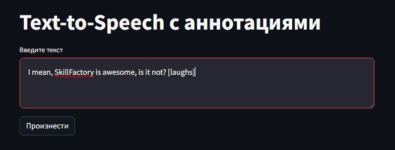
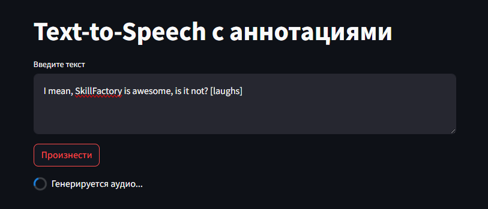
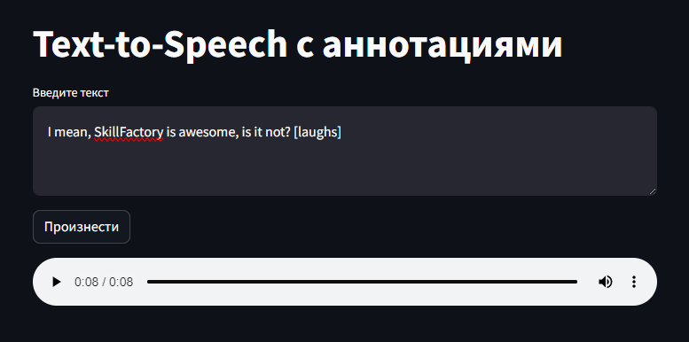

# PI_URFU_2023

## Команда
* Пахомов Д.Е.
* Болотов М.В.
* Шибакова А.А.
* Султанов Э.М.

## Практическое задание №1 (pz1)
Создание базовых приложений, использующие готовые библиотеки машинного обучения.

### `d.pakhomov.py`
**Задача:** Генерировать голос из текста с метатагами для таких звуков как смех, плач и т.д.

**Описание:** Text-to-Speech с помощью модели `suno/bark-small`. Переменная `text_prompt` принимает текст, аудиозаписи сохраняются в папке `bark-outputs`.

### `m.bolotov.py`
**Задача:** Получить ответ на вопрос, заданный пользователем.

**Описание:** Пользователь описывает ситуацию модели `deepset/roberta-base-squad2` в вопросе/подсказке и просит модель сгенерировать ответ с учетом предоставленной информации. 
В этом сценарии модель выбирает соответствующие части информации из подсказки и возвращает результаты.

### `a.shibakova.py`
**Задача:** Создание чат-бота, который предлагает различные темы для последующего диалога.

**Описание:** чат-бот моделирует разговор с пользователем. Либо чат-бот может создавать темы для диалога, либо пользователь. 

### `s.sultanov.py`
**Задача:**  Анализ эмоциональной окраски текста на русском языке

**Описание:** Данный скрипт анализирует эмоциональную окраску текста с использованием модели "seara/rubert-tiny2-ru-go-emotions". Он запрашивает у пользователя текст для анализа и выводит результаты, показывая эмоцию, которая была обнаружена в тексте, а также уверенность модели в этой эмоции.

## Практическое задание №2 (pz2)
Создание Streamlit приложений на основе первого практического задания.

### `d.pakhomov.py`
Данное веб-приложение конвертирует текст с семантическими аннотациями в аудио человеческой речи с помощью модели [`suno/bark-small`](https://huggingface.co/suno/bark-small).

#### Используемые библиотеки
* [PyTorch](https://pytorch.org)
* [Transformers (HuggingFace)](https://huggingface.co)
* [Streamlit](https://streamlit.io)

#### Примеры

https://github.com/sultanovemil/PI_URFU_2023/assets/32728173/d2b44601-238d-4c5b-a176-ba77dde3b440

